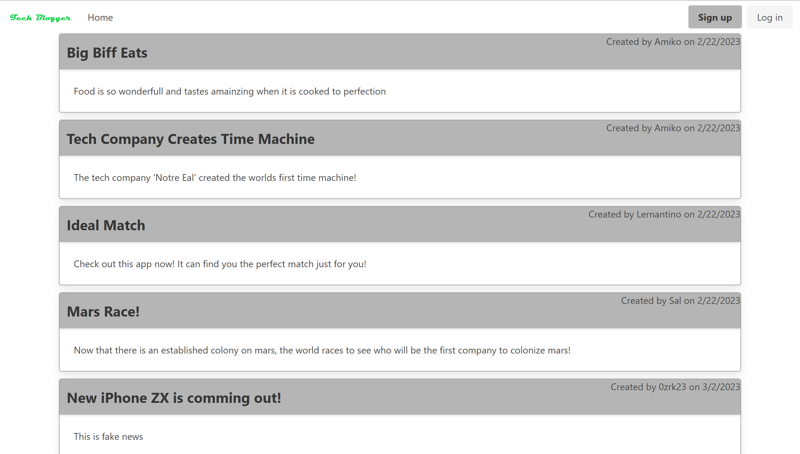

# Tech Blogger

## Description

Welcome to Tech Blogger! This web app is a place where you can blog about cutting edge and bleeding edge technology and have a discussion with other users of this website! Tech Blogger was designed to be able to save and show many blogs and commnets as well as allow you to post blogs of your own! It uses Sequelize for the Database and Express-Handlebars for the routes and front end.

## Table of Contents
 - [Usage](#usage)
 - [Links](#links)
 - [Credits](#credits)
 - [License](#license)
 - [Questions](#questions)
 

## Usage

[tech-blogger-how-to.webm](https://user-images.githubusercontent.com/115580058/222570108-f7c38cd6-d5a8-4f58-adb4-f1b0e274e22d.webm)

<!--  -->
<!-- <video controls>
    <source src="https://drive.google.com/file/d/1BCbOegH9BonY1yn0b9THG3i30eq9aQz0/preview" type="video/webm">
    <a href="/public/videos/tech-blogger-how-to.webm">WEBM</a>
</video> -->

To use this application, visit [Tech Blogger](tech-blogger-production.up.railway.app) to get started. When it loads, it will display all  of the current blogs that you can see and comment. You'll have to sign in or sign up to do anything though. Once signed in, it will direct to you your profile page that contains all of the blogs you have created so far. From there you can create or delete your very own blogs. You can also visit other user's blogs by going to the home page and clicking on any of them. You can add a comment here.

## Links

[Tech Blogger Homepage](https://tech-blogger-production.up.railway.app/)

## Credits

Creator: Gustavo Carrillo

## License

This project is under the MIT License

## Questions
     
If you want to contact me, please use the following

 - [GitHub Profile](https://github.com/0zrk23)
 - [Email](gus.carrillo1221@gmail.com)
